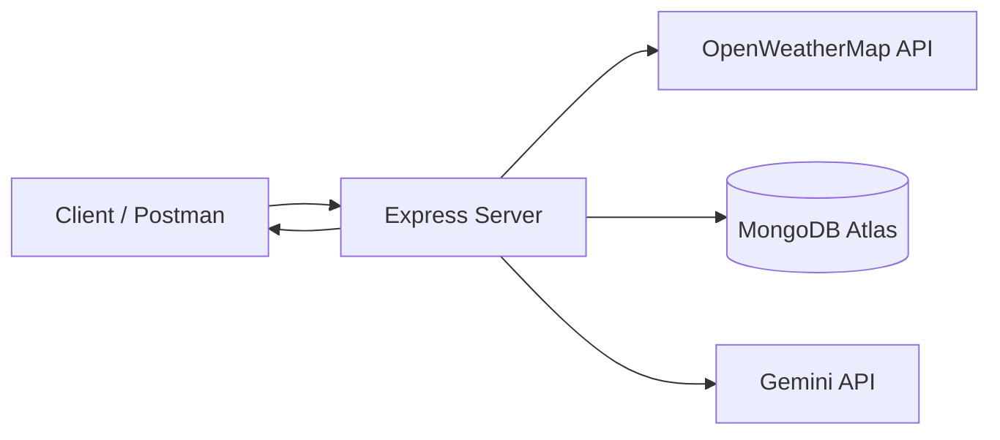

# AI WeatherWise

A backend Weather API that fetches real-time weather for any city and adds an AI-generated summary and advice on top of it.

Built with **Node.js**, **Express**, **MongoDB Atlas**, **OpenWeatherMap** and **Google Gemini**.

---

## Table of Contents

1. [Introduction](#introduction)
2. [Objectives](#objectives)
3. [Tech Stack](#tech-stack)
4. [System Architecture](#system-architecture)
5. [Project Structure](#project-structure)
6. [API Endpoints](#api-endpoints)
7. [Database Design](#database-design)
8. [Setup and Installation](#setup-and-installation)
9. [Testing](#testing)
10. [Challenges and Solutions](#challenges-and-solutions)
11. [Future Enhancements](#future-enhancements)
12. [Conclusion](#conclusion)

---

## Introduction

AI WeatherWise returns current weather data for a city and uses Google Gemini to turn that raw data into a short, easy-to-read summary with practical suggestions. Searched results are stored in MongoDB Atlas so they can be viewed later.

## Objectives

- Provide a simple REST API to get current weather for a city
- Store searched weather records in a database
- Use AI (Gemini) to generate a human-friendly summary and advice
- Keep the backend modular, easy to test and easy to extend

## Tech Stack

| Component | Technology |
|---|---|
| Runtime | Node.js |
| Framework | Express.js |
| Database | MongoDB Atlas (Mongoose) |
| Weather data | OpenWeatherMap API |
| AI service | Google Gemini API |
| API testing | Postman |

## System Architecture



1. Client sends a GET request with a city name
2. Express route validates the request
3. Server fetches live weather from OpenWeatherMap
4. Weather record is saved in MongoDB Atlas
5. Data is sent to Gemini, which returns a summary and advice
6. Server returns the combined JSON response

## Project Structure

```
AI-WEATHERWISE/
├── server.js          # app entry point
├── routes/            # API route definitions
├── controllers/       # request handling logic
├── models/            # Mongoose schemas
├── services/          # OpenWeatherMap and Gemini calls
├── .env               # secrets (not pushed to GitHub)
└── package.json
```

> Update this tree if your folder names are different.

## API Endpoints

| Method | Endpoint | Description |
|---|---|---|
| GET | `/api/weather/:city` | Current weather and AI summary for a city |
| GET | `/api/weather/history` | List previously searched records |
| DELETE | `/api/weather/:id` | Delete a saved record |

> Update the paths if your routes are named differently.

**Sample response**

```json
{
  "city": "Chennai",
  "temperature": 31.2,
  "humidity": 74,
  "condition": "Partly cloudy",
  "aiSummary": "Warm and humid. Carry water and wear light clothes."
}
```

## Database Design

**Collection: `WeatherRecord`**

| Field | Type | Description |
|---|---|---|
| city | String | City searched |
| temperature | Number | Temperature in °C |
| humidity | Number | Humidity percentage |
| condition | String | Weather description |
| aiSummary | String | Summary generated by Gemini |
| createdAt | Date | Record creation time |

## Setup and Installation

```bash
# 1. Clone the repository
git clone https://github.com/<your-username>/AI-WEATHERWISE.git
cd AI-WEATHERWISE

# 2. Install dependencies
npm install

# 3. Create a .env file (see below)

# 4. Start the server
npm start
```

**.env**

```env
PORT=5000
MONGO_URI=your_mongodb_atlas_connection_string
OPENWEATHER_API_KEY=your_openweathermap_key
GEMINI_API_KEY=your_gemini_key
```

> Never commit your `.env` file. Add it to `.gitignore`.

## Testing

All endpoints were tested with Postman.

| No. | Test Case | Expected Result | Status |
|---|---|---|---|
| 1 | Valid city (e.g., Chennai) | 200 OK with weather and AI summary | Pass |
| 2 | Invalid city name | 404 with error message | Pass |
| 3 | Fetch history | 200 OK with list of records | Pass |
| 4 | Delete record by id | 200 OK, record removed | Pass |

## Challenges and Solutions

- **Third-party API errors:** handled with try/catch and clear error messages
- **Keeping secrets safe:** stored keys in `.env` and excluded it from Git
- **Useful AI output:** wrote a clear prompt so Gemini returns short, practical advice

## Future Enhancements

- 5-day forecast and weather alerts
- User accounts and favorite cities
- Frontend dashboard with charts
- Caching to reduce repeated API calls

## Conclusion

AI WeatherWise shows how a traditional REST API can be combined with a generative AI model to give more useful information than raw data alone. The project covered backend development with Node.js and Express, MongoDB Atlas, external API integration and API testing with Postman.

## References

- OpenWeatherMap API documentation
- Google Gemini API documentation
- Express.js and Mongoose documentation
- MongoDB Atlas documentation
